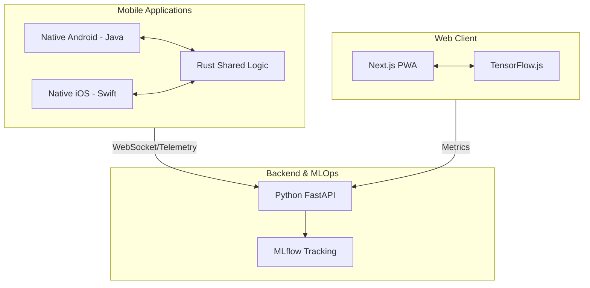

# SleepSafe Architecture Documentation

## 🏗️ System Overview
SleepSafe is a cross-platform sleep detection ecosystem utilizing **Edge AI** (on-device processing) and **Cloud MLOps**.

### 🗺️ Infrastructure Diagram

---

## 💻 Core Components

### 1. Rust Core (`/core`)
- **Purpose**: High-performance, memory-safe shared logic for sleep detection algorithms.
- **Integration**: 
  - **Android**: Integrated via **JNI** (Java Native Interface).
  - **iOS**: Integrated via **FFI** (Static/Dynamic library) and C-Bridging header.
- **Tech**: Cargo, C-compatible FFI.

### 2. Native Mobile (`/app`)
- **Android**: Native Java implementation focusing on sensor data collection and UI.
- **iOS**: Native Swift implementation using SwiftUI/UIKit.
- **Key Feature**: Offloads heavy processing to the Rust core to ensure low battery consumption and high performance.

### 3. Web PWA (`/web`)
- **Purpose**: Browser-based monitoring that works offline.
- **Aesthetics**: Glassmorphism UI, Dark Mode, Micro-animations.
- **Model**: Uses MediaPipe Face Mesh on the client side via TensorFlow.js.

### 4. Backend & MLOps (`/api`)
- **Purpose**: Centralized telemetry, model management, and offline training.
- **Tech Stack**: 
  - **FastAPI**: Main API gateway.
  - **UV**: Fast dependency management.
  - **MLflow**: Tracks experiments, model versions, and training logs.
- **Docker**: Containerized deployment for consistent environments.

---

## 🛠️ Data Flow
1. **Input**: Camera frames (Web/Native) or Motion Sensors (Native).
2. **Detection**:
   - **Eyes**: EAR (Eye Aspect Ratio) calculation via landmarks.
   - **State**: Rust core or TF.js determines "AWAKE" vs "SLEEPING".
3. **Action**: 
   - Local Audible Alarm.
   - UI Alert.
   - (Optional) Telemetry sent to Backend.

---

## 🔒 Security & Privacy
- **Client-Side Processing**: Facial landmarks are processed locally; images never leave the device unless explicitly configured for training.
- **Offline First**: Core functionality remains 100% operational without internet.
